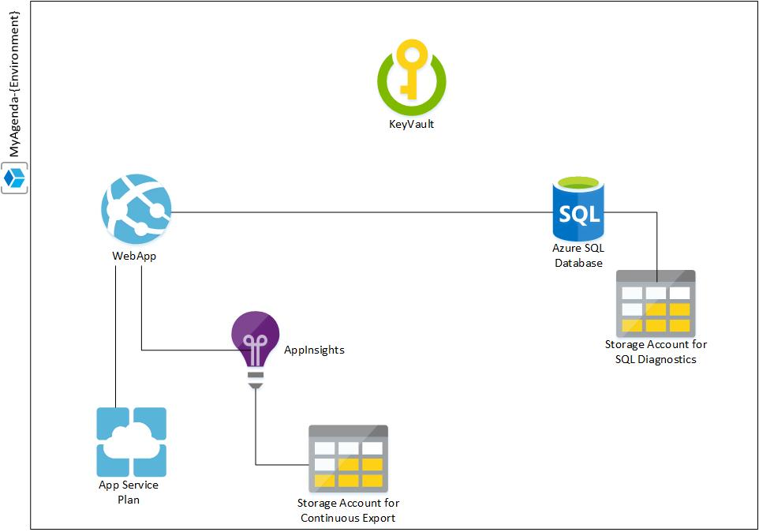

# azure-devops-release-pipeline

In order to show how to integrate infrastructure and application in a single repo with a single pipeline, this repo was put in place. It contains a very simple agenda web application written in .NET Core with a SQL Server DB as backend. The architecture of the application looks like this:

## Folder: Application
This folder contains the application code which is an MVC .NET Core 2.0 app which makes use of EF (Entity Framework) Core in database-first mode.

## Folder: Database
This folder contains the database project which is developed with SQL Server Data Tools (SSDT) in order to generate the required dacpac.

## Folder: Infrastructure
This folder contains the infrastructure code for Azure (basically all the ARM Template required to create the architecture shown above). Some interesting files on this folder are:

* *azureDeploy.json*: this is the main template which calls all the other linked ones.
* *azureDeploy.tests.ps1*: this is a Pester script to validate all ARM Templates syntax
* *build.ps1*: this script is meant to "build" the infrastructure artifacts
* **linked** folder: contains building pieces of infrastructure
* **scripts** folder: helpers scripts to fill gaps not covered by ARM Template or required for the pipeline to run properly