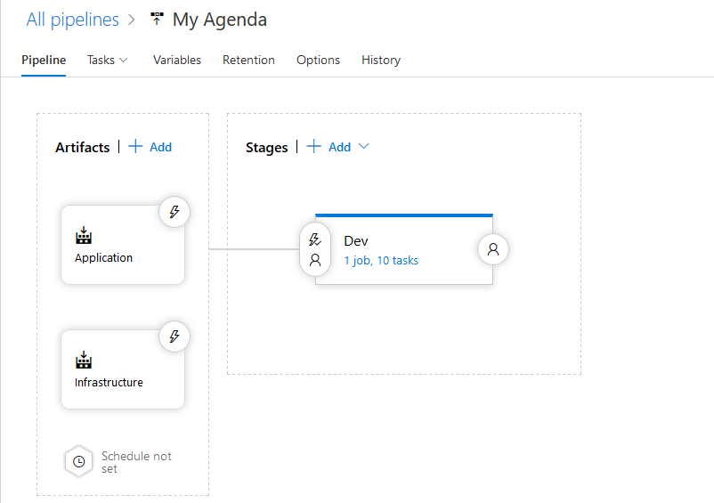
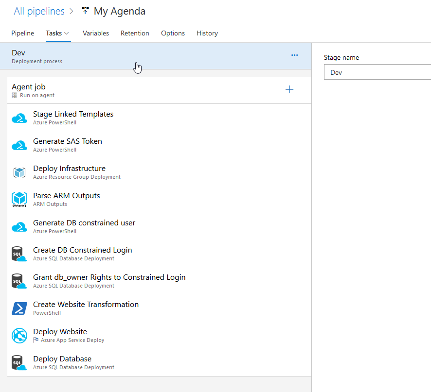
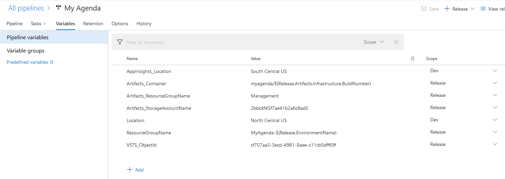
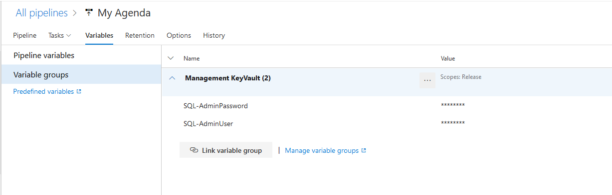

# Release
This folder contains the Release pipeline export where Application and Infrastructure are deployed together as a single thing.

In this example there's a single environment defined called "Dev" which executes the requires steps to deploy and configure the webapp:

Part of the used variables through the pipeline are defined as Pipeline variables:

Or defined as variable groups by using an Azure KeyVault as source in order to allow separation of dutties and have other teams manage these:

